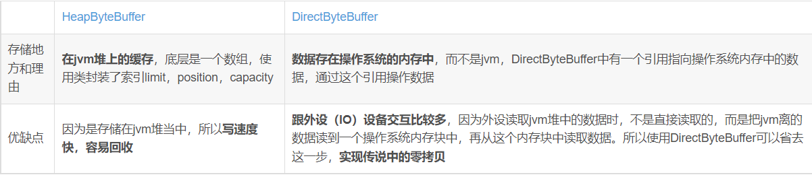

# NIO基础
## 1.三大组件
### 1.1 Channel 
> channel类似于stream，是读写数据的双向通道，stram只能是单向的。类型：FileChannel、DatagramChannel（UDP channel）、SocketChannel。ServerSocketChannel四种，后面两种是基于TCP。
### 1.2 Buffer
> buffer是缓冲区，常见的buffer：ByteBuffer接口，实现类有MappedByteBuffer、DirectByteBuffer、HeapByteBuffer。
### 1.3 Selector
>多线程版本设计

线程池版本

>selector模式 

## 2.ByteBuffer的结构
>-  有三个参数：position、limit（读取限制）、capacity(容量)。
>- 调用flip方法之后，limit将会由写限制转换成读限制。

> - clear()方法将读模式转化成写模式。
> - compact()转换成写模式，将会保留未读的数据！
> 
>- ByteBuffer抽象类的两个实现类：HeapByteBuffer和DirectByteBuffer区别
> 
> - allocate，只能分配固定的大小。
> - rewind（）从新读取缓冲区。
> - mark&reset方法，mark做一个消息，记录position位置，reset是将position重置到mark位置。
> - 字符串转换成ByteBuffer的方法，字符串.getBytes(),StandardCharsets.UTF_8.encode(字符串)，Bytewarp.wrap()。
> - bytebuffer黏包半包分析。
粘包 ：发送方在发送数据时，并不是一条一条地发送数据，而是将数据整合在一起，当数据达到一定的数量后再一起发送。这就会导致多条信息被放在一个缓冲区中被一起发送出去
半包： 接收方的缓冲区的大小是有限的，当接收方的缓冲区满了以后，就需要将信息截断，等缓冲区空了以后再继续放入数据。这就会发生一段完整的数据最后被截断的现象
## 3.FileChannel
>- FileChannel只能工作在阻塞模式下面。
> 
> - channel之间的传输，FileChannel.transferTo(long position, long count, WritableByteChannel target)//效果高，会存在文件大小传输的限制！
> - Path,jdk7中引入的，Paths是工具类，path是表示文件的路径。Paths.get("D:/1.txt)=Paths.get("D:\\1.txt);Files.walkFileTree()//可以递归的访问文件。
> - Files,jdk7引入的，Files.exists(path);Files.createDirectory(path);
> - java中的匿名内部类不能访问到类中的成员变量？？？
## 4.Blocking IO & No-Blocking IO & NIO
> - debug小技巧，可以通过打断点手动的去修改程序的值，evaluate expression。

> - Blocking IO,阻塞模式下一个服务端线程只能处理一个客服端线程请求.
```java
/**
 * @program: AlianNetty
 * @author: alian
 * @description: 服务器
 * @create: 2022-04-15 09:01
 **/

package alian.bio;

import lombok.extern.slf4j.Slf4j;
import util.ByteBufferUtil;

import java.io.IOException;
import java.net.InetSocketAddress;
import java.nio.ByteBuffer;
import java.nio.channels.ServerSocketChannel;
import java.nio.channels.SocketChannel;
import java.util.ArrayList;
import java.util.List;
@Slf4j
public class Server {
    public static void main(String[] args) throws IOException {
        // 建立服务器的连接
        ServerSocketChannel ssc = ServerSocketChannel.open();

        //绑定监听端口
        ssc.bind(new InetSocketAddress(8080));

        //连接集合
        List<SocketChannel> channels = new ArrayList<>();

        //读取buffer
        ByteBuffer buffer = ByteBuffer.allocate(16);

        while(true){
            log.debug("connecting........");
            SocketChannel sc=ssc.accept();// accept建立与客服端的连接，阻塞方式
            log.debug("conected、、、、、、、、、{}",sc);
            channels.add(sc);
            for (SocketChannel channel : channels) {
                log.debug("before read/........{}",channel);
                channel.read(buffer);
                buffer.flip();// 切换模式
                ByteBufferUtil.debugAll(buffer);
                buffer.clear();
            }
        }
    }
}

```
> - NO-Blocking IO,非阻塞模式下，一个服务端线程可以处理多个客服端线程请求，但是服务端线程必须不停的轮询！
```java
/**
 * @program: AlianNetty
 * @author: alian
 * @description: 服务器
 * @create: 2022-04-15 09:01
 **/

package alian.nbio;

import lombok.extern.slf4j.Slf4j;
import util.ByteBufferUtil;

import java.io.IOException;
import java.net.InetSocketAddress;
import java.nio.ByteBuffer;
import java.nio.channels.ServerSocketChannel;
import java.nio.channels.SocketChannel;
import java.util.ArrayList;
import java.util.List;
/**
* @Description: 非阻塞模式会不会进行阻塞，应该要采用轮询的方式完成业务逻辑
* @Param:
* @return:
* @Author: alian
* @Date: 2022/4/15
*/
@Slf4j
public class Server {
    public static void main(String[] args) throws IOException {
        // 建立服务器的连接
        ServerSocketChannel ssc = ServerSocketChannel.open();
        ssc.configureBlocking(false);//设置非阻塞模式

        //绑定监听端口
        ssc.bind(new InetSocketAddress(8080));

        //连接集合
        List<SocketChannel> channels = new ArrayList<>();

        //读取buffer
        ByteBuffer buffer = ByteBuffer.allocate(16);

        while(true){
            SocketChannel sc=ssc.accept();// accept建立与客服端的连接，非阻塞方式
            if(sc!=null){
                sc.configureBlocking(false);// 设置非阻塞模式
                log.debug("conected、、、、、、、、、{}",sc);
                channels.add(sc);
            }
            for (SocketChannel channel : channels) {
                int read = channel.read(buffer);
                if(read>0){
                    buffer.flip();// 切换模式
                    ByteBufferUtil.debugAll(buffer);
                    buffer.clear();
                }
            }
        }
    }
}

```
> - NIO,select可以监听多个channel，一旦有事件过来就进行处理。
```java
/**
 * @program: AlianNetty
 * @author: alian
 * @description: 服务器
 * @create: 2022-04-15 09:01
 **/
package alian.nio;
import lombok.extern.slf4j.Slf4j;
import java.io.IOException;
import java.net.InetSocketAddress;
import java.nio.ByteBuffer;
import java.nio.channels.*;
import java.util.Iterator;

@Slf4j
public class Server {
    public static void main(String[] args) throws IOException {
        // 创建selector对象，管理多个channe
        Selector selector = Selector.open();
        // 建立服务器的连接
        ServerSocketChannel ssc = ServerSocketChannel.open();
        ssc.configureBlocking(false);
        //绑定监听端口
        ssc.bind(new InetSocketAddress(8080));
        //读取buffer
        ByteBuffer buffer = ByteBuffer.allocate(16);
        // 建立selector的联系-将channel注册到selector中
        // SelectionKey事件发生后，通过它可以知道是哪个channel发生的事件
        // 事件的类型： accept、connect、read、write四种类型。
        SelectionKey sscKey = ssc.register(selector, 0, null);
        // ssckey只关注accept事件
        sscKey.interestOps(SelectionKey.OP_ACCEPT);
        log.debug("registry key{}",sscKey);
        while(true){
            // selector没有事件就会阻塞，有事件就会运行
            selector.select();
            //处理事件
            Iterator<SelectionKey> iterator = selector.selectedKeys().iterator();
            //electionKeys中包含了所有发生的事件
            while(iterator.hasNext()){
                SelectionKey key = iterator.next();
                log.debug("触发的可以：{}",key);
                ServerSocketChannel channel = (ServerSocketChannel) key.channel();
                SocketChannel accept = channel.accept();//建立连接
                log.debug("{}",accept);
            }
        }
    }
}
```
## 5.服务端和客户端的问题
> - 客服端关闭会引起服务器端的错误，客户端主动关闭和异常关闭都会触发select中的读事件。
```java
if(key.isReadable()){//读信息
        try{
        SocketChannel channel=(SocketChannel)key.channel();
        int read=channel.read(buffer);
        if(read==-1){
        // 客户端主动关闭的时候，read事件会返回一个-1作为标识
        key.cancel();
        }else{
        buffer.flip();
        ByteBufferUtil.debugAll(buffer);
        }
        }catch(IOException e){
        // 将异常的客户端对应的channel进行删除，从select中的key删除
        key.cancel();
        e.printStackTrace();
        }
        }
```
> - 消息处理 （处理消息边界的问题，buffer大小不好确定，会存在粘包和黏包的问题）
>解决方法：1，固定消息长度，2，按照分隔符进行读取，3，按照TLV格式（Type Length Value http1.1）或者LTV（length，type，value http2.0）
> Ctrl+Alt+T 重构
> 
> P 36