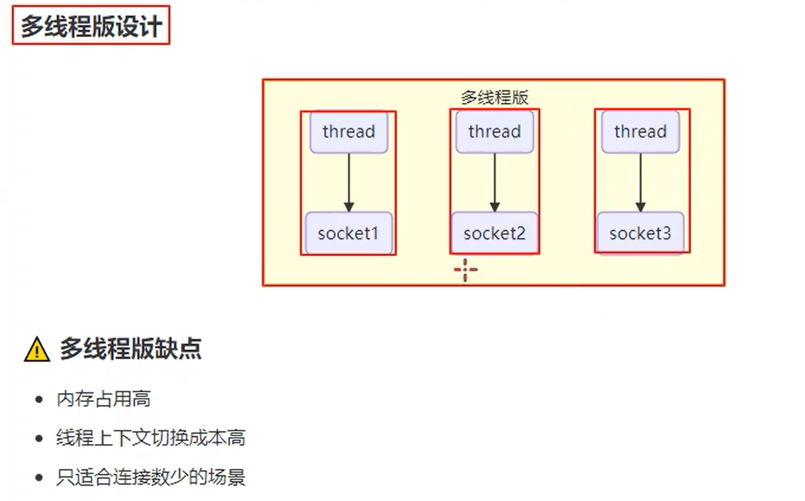
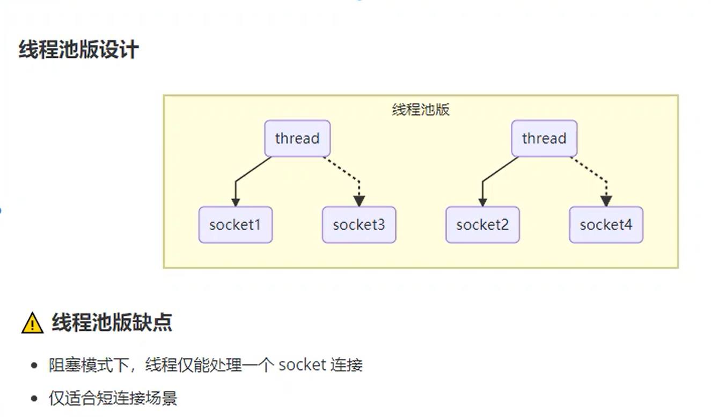
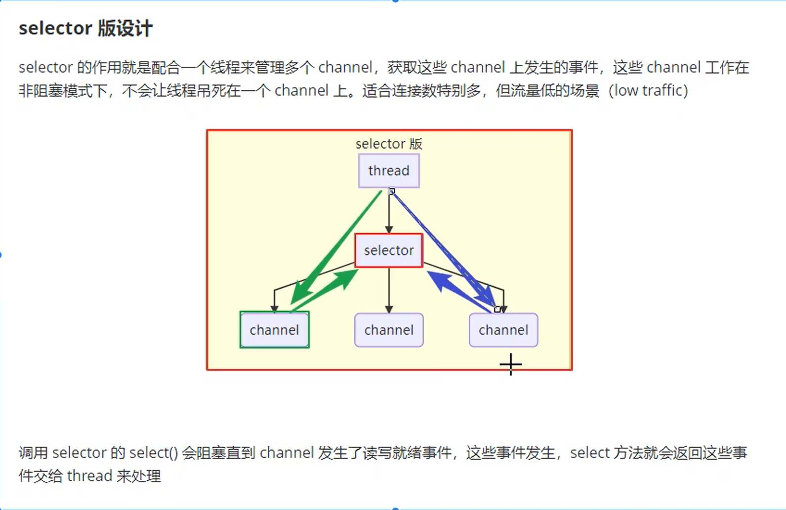
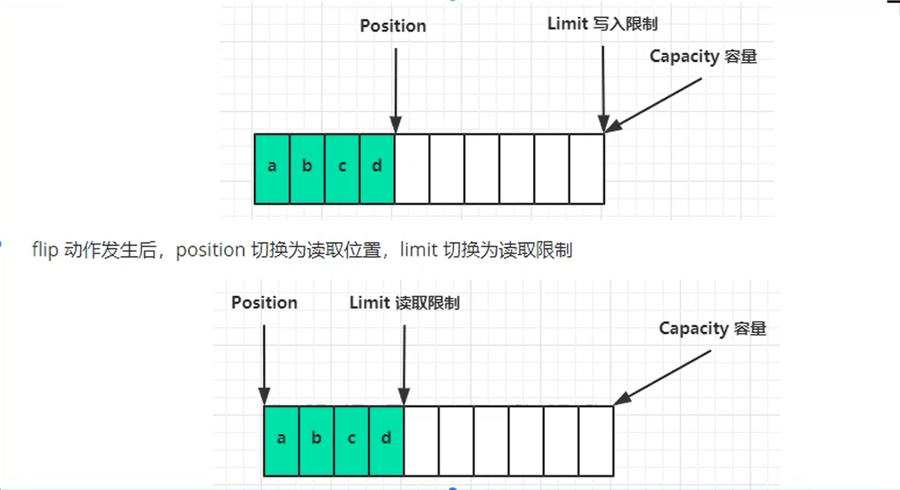
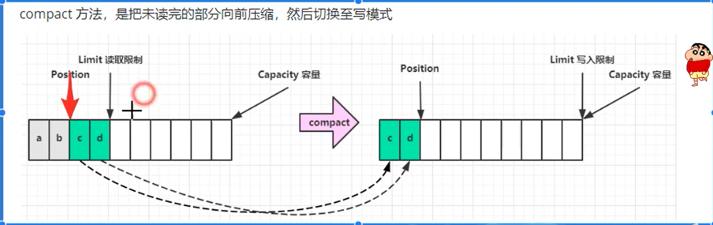

# NIO基础
## 1.三大组件
### 1.1 Channel 
> channel类似于stream，是读写数据的双向通道，stram只能是单向的。类型：FileChannel、DatagramChannel（UDP channel）、SocketChannel。ServerSocketChannel四种，后面两种是基于TCP。
### 1.2 Buffer
> buffer是缓冲区，常见的buffer：ByteBuffer接口，实现类有MappedByteBuffer、DirectByteBuffer、HeapByteBuffer。
### 1.3 Selector
>多线程版本设计

线程池版本

>selector模式 

## 2.ByteBuffer的结构
>有三个参数：position、limit（读取限制）、capacity(容量)。
>调用flip方法之后，limit将会由写限制转换成读限制。

> clear()方法将读模式转化成写模式。
> compact()转换成写模式，将会保留未读的数据！
> 

P8

